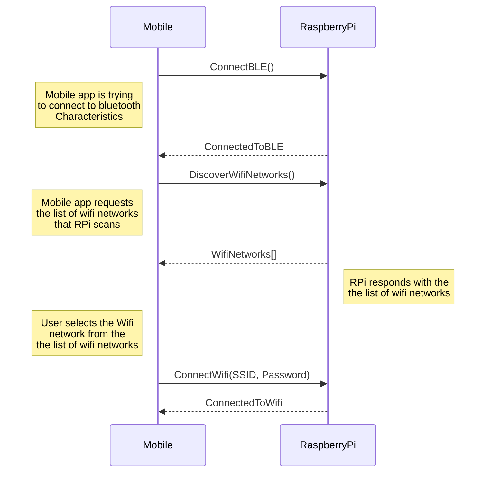
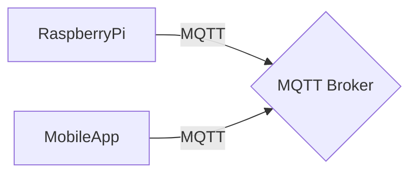

[](https://buymeacoff.ee/mariosk6)
[](./LICENSE.md)
[](https://github.com/gardenifi/raspirri_server/issues)
[](https://gardenifi.github.io/raspirri_server/)


[](https://github.com/gardenifi/raspirri_server/actions/workflows/tests.yml)
[](https://codecov.io/gh/gardenifi/raspirri_server)


# Raspberry Pi-based Smart Irrigation System (RaspirriV1)

RaspirriV1 is an intelligent irrigation system powered by RaspirriV1, a versatile server software designed for Raspberry Pi. Compatible with Raspbian OS and tested on both Raspberry Pi Zero and Raspberry Pi 4 models, RaspirriV1 offers a robust solution for automating irrigation. Notably, this system can be easily adapted for use with other IoT devices, requiring minimal modifications for scheduling specific date and time-based activations or deactivations. Leverage the flexibility of RaspirriV1 to enhance the efficiency of your irrigation system or adapt it for various IoT applications with ease.

## Table of Contents

- [Getting Started](#getting-started)
- [Usage](#usage)
- [Pre-commit](#pre-commit)
- [Quality Assurance](#quality-assurance)
- [Contributing](#contributing)
- [License](#license)
- [Acknowledgments](#acknowledgments)
- [Build Status](#build-status)
- [Contact](#contact)
- [UML Diagrams](#uml-diagrams)

## Getting Started

To get a copy of the project up and running on your local machine, follow these steps. This project includes:
- Source code and test code is seperated in different directories.
- External libraries installed and managed by [Pip](https://pypi.org/project/pip/) and [setuptools](https://setuptools.pypa.io/en/latest/) in a pyproject.toml.
- Setup for tests using [Pytest](https://docs.pytest.org/en/stable/) and coverage with [Pytest-Cov](https://github.com/pytest-dev/pytest-cov).
- Continuous testing with [Github-Actions](https://github.com/features/actions/) including [pre-commit](https://github.com/pre-commit/pre-commit).
- Code coverage reports, including automatic upload to [Codecov](https://codecov.io).
- Code documentation with [Mkdocs](https://www.mkdocs.org/).

### Prerequisites

- Use an SD memory stick with at least 16GB or RAM
- Download [Raspberry Pi OS](https://www.raspberrypi.com/software/)
- Execute Raspberry Pi Imager
- Choose Storage > USB Disk Drive with SD memory stick
- Choose OS > Raspberry Pi OS Lite (32 bit)
- Settings > Enable SSH, Hostname: raspirriv1.local, username/pass: pi/raspberry, Configure WLAN
- WRITE (Wait to format and install OS in your SD card)
- Insert SD card in RPi and connect it to USB

If you forgot the wifi pass or you made a mistake you may fix it with a file called wpa_supplicant.conf:
```
ctrl_interface=DIR=/var/run/wpa_supplicant GROUP=netdev
update_config=1
network={
	ssid="YOUR_SSID"
	psk="your_pass"
	key_mgmt=WPA-PSK
}
```
Add it in the /bootfs of the SDRAM and rebooot

- Enter RPi and install git:
    ```
    sudo apt -y update
    sudo apt -y install git
    git --version
    git clone https://github.com/gardenifi/raspirri_server.git
    cd raspirri_server
    ```
 - Make sure you create a file called secret_env.sh with contents. Otherwise you will be asked to provide these values during installation.
```
export MQTT_HOST=abc.s1.eu.hivemq.cloud
export MQTT_PORT=8883
export MQTT_USER=broker_user
export MQTT_PASS=broker_pass
```
The above credentials are used to access your MQTT broker. In our experiments we used [HiveMQ platform](https://www.hivemq.com/).

### Installation
Enter /var/tmp/ and download the latest release: https://github.com/gardenifi/raspirri_server/releases and after untar enter the folder and execute:
```
./install.sh
```
or do it programmatically:
```
./upgrade.sh
```

If you would like to uninstall it.
```
./uninstall.sh
```

### Verify that Python services are running
You should have 2 python linux services running on your RPi board:
```
pi@raspirriv1:/var/tmp/ $ ps -def | grep python
root 5148 5138 16 11:29 ? 00:00:01 python3 raspirri/main_app.py mqtt
root 5188 5179 14 11:29 ? 00:00:00 python3 raspirri/main_app.py ble
```

### View logs
```bash
sudo journalctl -f -u rpi_server.service
sudo journalctl -f -u rpi_ble_server.service
sudo journalctl -f -u rpi_watchdog_server.service
```

### Clearing all logs (including active ones):
To clear all logs, including the currently active ones, you can stop the systemd-journald service, remove the journal files, and then start the service again:
```
sudo systemctl stop systemd-journald
sudo rm /var/log/journal/*/*  # Remove all journal files
sudo systemctl start systemd-journald
```
Be cautious with this method, as it will clear all logs, including the ones still being written.

### Restart, Stop, Disable, Enable Services
#### Restart
```bash
sudo systemctl restart rpi_server.service
sudo systemctl restart rpi_ble_server.service
sudo systemctl restart rpi_watchdog_server.service
```

#### Stop
```bash
sudo systemctl stop rpi_server.service
sudo systemctl stop rpi_ble_server.service
sudo systemctl stop rpi_watchdog_server.service
```

#### Disable
```bash
sudo systemctl disable rpi_server.service
sudo systemctl disable rpi_ble_server.service
sudo systemctl disable rpi_watchdog_server.service
```

#### Enable
```bash
sudo systemctl enable rpi_server.service
sudo systemctl enable rpi_ble_server.service
sudo systemctl enable rpi_watchdog.service
```

## Pre-commit
After installation of the project you should have installed the [pre-commit tool](https://pre-commit.com/). On every git commit you run locally, pre-commit hooks will run and protect your code changes against errors that are related with the following plugins:
```bash
(venv) pi@raspberrypi:~/raspirri_server $ pre-commit run --all-files
debug statements (python)..........................................................Passed
check docstring is first...........................................................Passed
fix end of files...................................................................Passed
check for merge conflicts..........................................................Passed
check json.....................................................(no files to check)Skipped
check for added large files........................................................Passed
check yaml.........................................................................Passed
python tests naming................................................................Passed
fix requirements.txt...........................................(no files to check)Skipped
trim trailing whitespace...........................................................Passed
autoflake..........................................................................Passed
black..............................................................................Passed
pyupgrade..........................................................................Passed
flake8.............................................................................Passed
pylint.............................................................................Passed
Run unit tests.....................................................................Passed
Checking whether Unit Tests code coverage is below threshold.......................Passed
```

## Quality Assurance

Most of the Unit Tests have been written with [Codium.AI](https://codium.ai/). Thank you Codium.AI!!

### Unit Testing
You may run unit tests in a Python virtual environment:
```bash
sudo rm -rf venv
virtualenv -p /usr/bin/python3 venv
source venv/bin/activate
pip3 install -r requirements.txt --break-system-packages
RUNNING_UNIT_TESTS=1 LOGLEVEL=debug PYTHONPATH=$(pwd)/raspirri coverage run --include='raspirri/*' -m pytest -rA -s -vv tests
```
### Unit Tests Code Coverage
You may create Unit Test Code Coverage reports by executing:
```bash
PYTHONPATH=$(pwd)/raspirri coverage report --fail-under=75 --include='raspirri/*' --skip-covered --sort=Cover -m

Name                       Stmts   Miss  Cover   Missing
--------------------------------------------------------
raspirri/ble/wifi.py              130     42    68%   52, 56, 98-99, 101-106, 109, 127, 131-132, 166-201
raspirri/server/mqtt.py            202     61    70%   164-179, 190-195, 200-207, 209-210, 215, 220-222, 227-244, 259, 262-265, 279, 283-285, 301-302, 335-344
raspirri/server/helpers.py         250     74    70%   192-193, 211-213, 228-230, 249-251, 297-300, 392, 425, 431-436, 452-455, 473, 476-492, 521-527, 565, 581-589, 611-627, 636
raspirri/main_app.py              164     38    77%   120, 140-142, 144, 158-159, 205, 227-229, 240-277, 281
raspirri/ble/bletools.py           24      4    83%   52-53, 56, 65
raspirri/server/const.py            55      9    84%   38-40, 47, 61-63, 92, 98-99
raspirri/ble/advertisement.py      81     10    88%   64, 90-92, 115-118, 123, 127, 131
raspirri/ble/service.py           189     22    88%   38-39, 68, 92, 96, 100-109, 113, 117-118, 173, 230, 245, 250, 255, 272-273, 307
raspirri/server/services.py        166     11    93%   105-108, 165-167, 341, 364-367
--------------------------------------------------------
TOTAL                       1278    271    79%
```
In column "Missing" you can see the code lines that are not covered so you can write more Unit Tests to increase the code coverage. The current threshold to pass Github actions is 75%.

### Quality Gates through Sonarqube

#### Install Sonarqube as root
```bash
sudo rm -rf sonarqube
mkdir -p sonarqube/logs && chmod 777 -R sonarqube && cd sonarqube
export SONARQUBE_HOME=$(pwd)
docker run --detach -d --name sonarqube \
-v $SONARQUBE_HOME:/opt/sonarqube/extensions \
-v $SONARQUBE_HOME:/opt/sonarqube/data \
-v $SONARQUBE_HOME:/opt/sonarqube/logs \
-p 9000:9000 \
-p 9092:9092 sonarqube

docker logs -f sonarqube
```

#### Create Project
- [a] Enter http://your_server:9000/ with admin/admin
- [b] Change admin password
- [c] Create a local project

#### Analyze your project
- [a] Generate a token for your project: e.g. run uuid command: 9475199c-9132-11ee-a11b-9f71450e156a
- [b] Enter your project's code folder (make sure you've pushed your code in a git repo)
- [c] Enter http://your_server:9000/tutorials?id=9475199c-9132-11ee-a11b-9f71450e156a and click on Locally link
- [d] Run the following docker container where sonar.projectKey=9475199c-9132-11ee-a11b-9f71450e156a and Dsonar.token=token that generated in (c)

```bash
export SONARQUBE_URL=192.168.11.172:9000
docker rm -f sonar-scanner
docker run --detach -d --name sonar-scanner \
-v $(pwd):/usr/src \
sonarsource/sonar-scanner-cli -Dsonar.projectKey=9475199c-9132-11ee-a11b-9f71450e156a \
-Dsonar.sources=. \
-Dsonar.host.url=http://${SONARQUBE_URL} \
-Dsonar.token=sqp_b3a1f41488c19e81ce2d45ceb90a0b4a4028a3be \
-Dsonar.scm.provider=git \
-Dsonar.python.version=3.9
-Dsonar.projectBaseDir=/usr/src
docker logs -f sonar-scanner
```
Check now in the SQ dashboard the results

## Usage

After installation there are two services that implement two major modules:
1. BLE (Bluetooth Low Energy): Implements the communication module between mobile device and the RPi through bluetooth protocol.
2. MQTT: Implements the standard protocol for IoT communication through Internet (Message Queuing Telemetry Transport).

Here is the folder/files structure explanation:
```bash
├── raspirri
│   ├── ble (bluetooth modules)
│   ├── server (RPi and MQTT modules)
│   └── main_app.py (FastAPI module)
├── certs (SSL certificates for the FastAPI server)
│   ├── cert.pem
│   └── key.pem
├── tests (unit tests)
│   ├── api (FastAPI & MQTT Unit Tests)
│   ├── ble (Bluetooth Unit Tests)
│   ├── server (RPi Unit Tests)
│   └── conftest.py
├── common.sh
├── debug.sh
├── deploy_actions.sh
├── env.sh
├── install.sh -> deploy_actions.sh
├── LICENSE.md
├── README.md
├── CHANGELOG.md
├── requirements.txt
├── requirements-dev.txt
├── rpi_ble_server.service
├── rpi_server.service
├── secret_env.sh
├── sonar-project.properties
├── uninstall.sh -> deploy_actions.sh
```

### Debugging
First of all you need to stop services:
```bash
sudo systemctl stop rpi_server.service
sudo systemctl stop rpi_ble_server.service
sudo systemctl stop rpi_watchdog_server.service
```
1. BLE module
```bash
(venv) pi@raspberrypi:~/raspirri_server $ ./debug.sh ble
/home/pi/raspirri_server
Virtual Environment Found...
Argument provided: ble
Argument used: ble
2023-12-05 20:06:40.434 | INFO     | __main__:main:241 - Initializing main...
2023-12-05 20:06:40.435 | DEBUG    | __main__:main:242 - Setting timezone to UTC
2023-12-05T20:06:40.666 | INFO                 | wifi:init_ble:166 | Initializing BLE module...
2023-12-05T20:06:40.669 | INFO                 | wifi:init_ble:169 | app path: /
2023-12-05T20:06:40.670 | INFO                 | wifi:init_ble:170 | app services: []
2023-12-05T20:06:40.671 | INFO                 | wifi:__init__:89 | Adding WifiCharacteristic completed.
2023-12-05T20:06:40.671 | INFO                 | wifi:_log_characteristics_added:76 | Adding characteristics completed.
2023-12-05T20:06:40.676 | INFO                 | service:register:101 | /: Adapter: /org/bluez/hci0
...
```
2. MQTT module:
```bash
(venv) pi@raspberrypi:~/raspirri_server $ ./debug.sh mqtt
/home/pi/raspirri_server
Virtual Environment Found...
Argument provided: mqtt
Argument used: mqtt
2023-12-05 20:06:07.439 | INFO     | __main__:main:241 - Initializing main...
2023-12-05 20:06:07.439 | DEBUG    | __main__:main:242 - Setting timezone to UTC
...
```
For debugging purposes a FastAPI submodule has been implemented in the MQTT module. You may find the FastAPI Swagger docs under these links:

https://RPI_IP_ADDRESS:5000/docs#/
https://RPI_IP_ADDRESS:5000/redoc
https://RPI_IP_ADDRESS:5000/openapi.json

## Releases

Every time you need to create a new release, you should execute the following commands and a new [CHANGELOG.md](https://github.com/gardenifi/raspirri_server/blob/main/CHANGELOG.md) will be created:

Example:
```
export NEW_VERSION=1.0.5
export PART=patch
bump2version --new-version ${NEW_VERSION} ${PART} --config-file bumpversion.cfg
git add bumpversion.cfg && git commit -m "Bumping version to v${NEW_VERSION}" && git push
git tag "v${NEW_VERSION}" && git push origin "v${NEW_VERSION}"
```

then a new release will be created (from Github actions) in the releases section [assets](https://github.com/gardenifi/raspirri_server/releases) with the same version number.


## Contributing

We welcome contributions! Please follow these steps to contribute:

1. Fork the repository
2. Create a new branch
3. Make your changes and commit them
4. Submit a pull request

## License

This project is licensed under the [Your License] - see the [LICENSE.md](LICENSE.md) file for details.

## Acknowledgments

- [Marios Karagiannopoulos](https://mariosk.wordpress.com)
- [Douglas Otwell](https://github.com/Douglas6/cputemp)

## Build Status

[](https://github.com/gardenifi/raspirri_server/actions/workflows/common-steps.yml)

## Contact

For questions or feedback, please contact Marios Karagiannopoulos at [mariosk@gmail.com].

## UML diagrams



When RPi connects to the Internet it connects right away to the broker defined in secret_env.sh

